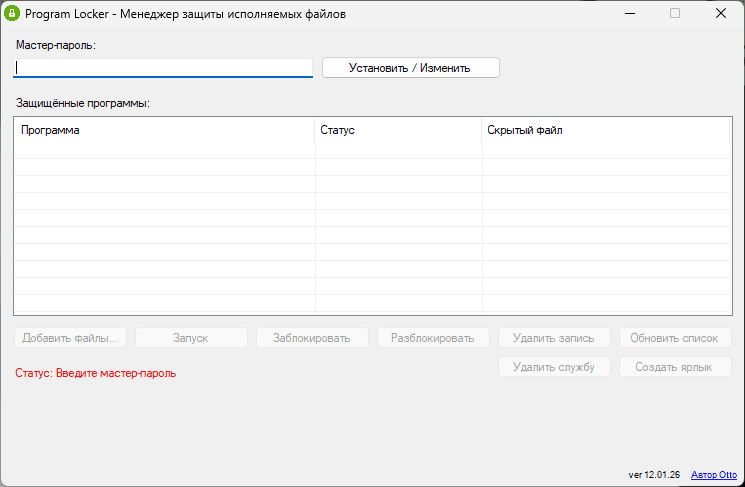
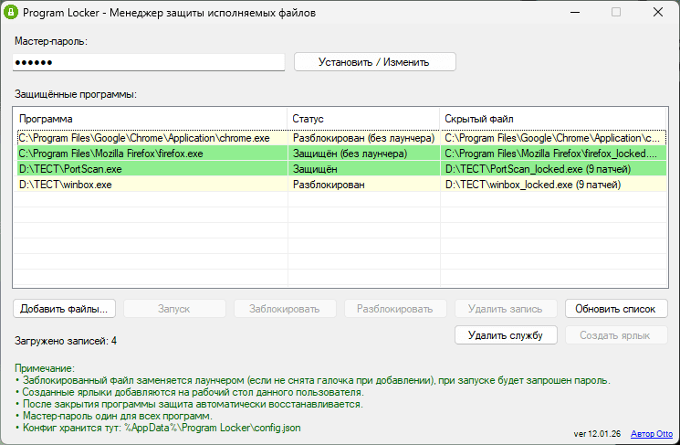
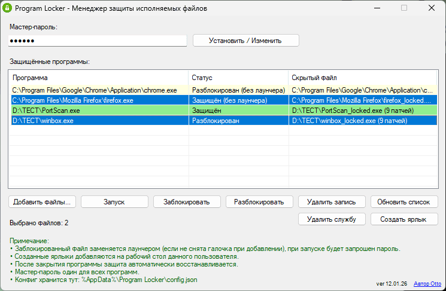
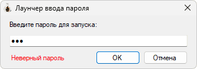

## Program Locker - программа для установки пароля на любые исполняемые файлы в Windows.

Программа предназначена для защиты от запуска другими людьми любых исполняемых файлов в Windows по средством установки пароля.

 

Используется: _.NET Framework 4.8_

Версия языка C#: _13.0_

_Проект полностью открыт и распространяется по лицензии MIT._

Ссылки на [GitHub](https://github.com/Otto17/Program_Locker) и [GitFlic](https://gitflic.ru/project/otto/program_locker).

---

**Описание:**

Установить через "**Setup Program Locker**" (это самораспаковывающийся архив), после установки на рабочем столе появится ярлык "_Program Locker_", через который можно выбрать исполняемые файлы и защитить их паролем, там же можно снять и защиту.

Удалить программу можно перейдя в папку с установленной программой "_Program Locker_" и запустив "_Uninstall.bat_".

ВНИМАНИЕ, ЕСЛИ ЗАБУДЕТЕ МАСТЕР-ПАРОЛЬ, ЛИБО УДАЛИТЕ "_Program Locker_" БЕЗ ПРЕДВАРИТЕЛЬНОЙ РАЗБЛОКИРОВКИ ФАЙЛОВ, ТО РАНЕЕ ЗАБЛОКИРОВАННЫЕ ПРОГРАММЫ РАЗБЛОКИРОВАТЬ БУДЕТ НЕВОЗМОЖНО!

---

**Использование:**

При первом запуске нужно установить мастер-пароль, для этого ввести его в поле "**Мастер-пароль**" и нажать кнопку "**Установить / Изменить**", подтвердив вторичным вводом.

После установки пароля ввести его ещё раз и нажать кнопку "**Добавить файлы…**", выбрать EXE файл(ы) и добавить их, файлы сразу защитятся, там же можно снять защиту, либо удалить программу(мы) из списка записей.

P.S. При удалении защищённых программ из списка записей кнопкой "**Удалить запись**" (либо клавишей "_Delete_"), удаляемые записи автоматически разблокируются (защита от дурака).

Защищённый конфиг файл хранится по пути "**%AppData%/Program Locker**" (для каждого пользователя создаётся свой конфиг), при удалении программы, конфиги удаляются у всех пользователей.

---

**Как это работает:**

Когда добавляется файл в список записей программы "_Program Locker_", тогда оригинальный файл портится на бинарном уровне разными методами патчей (что бы его было невозможно запустить), затем переименовывается (в конец названия файла добавляется суффикс "_\_locked.exe_"), а рядом создаётся фейковый файл с такой же иконкой и оригинальным названием заблокированной программы.

При запуске фейковой программы появляется окно ввода пароля (попытки ввода не ограничены), если пароль введён верно, тогда фейковый файл удаляется, оригинальному (исходному) файлу возвращается его имя и восстанавливается его внутренняя бинарная структура, после чего происходит запуск оригинального файла, как только оригинальная программа (включая её копии процессов) будут завершены, тогда сразу же происходит повторная, автоматическая блокировка (портится бинарный код оригинальной программы, переименовывается с суффиксом "_\_locked.exe_" и создаётся фейковый файл, вместо оригинала).

При разблокировки (ранее заблокированной программы) через "_Locker Launcher_" фейковый файл удаляется, восстанавливается внутренняя структура оригинального бинарного файла, удаляется суффикс из имени и всё, файл остаётся таким же, как и был до блокировки.

---

**Защита AES-256-CBC + HMAC-SHA256:**

Предусмотрена защита в виде HMAC (работает в связке с AES-256), для быстрой проверки пароля, защиты от подмены (если кто-то изменит конфиг "_config.json_") и атак на основе подбора (padding oracle attacks):

```plaintext
Шифрование:
┌─────────┐    ┌─────────┐    ┌────────────┐
│ Пароль  │───►│  KDF    │───►│ AES ключ  │───► Шифрует данные
└─────────┘    │(PBKDF2) │    │ HMAC ключ │───► Считает HMAC
               └─────────┘    └────────────┘

Расшифровка:
┌─────────┐    ┌─────────┐    ┌────────────┐
│ Пароль  │───►│  KDF    │───►│ HMAC ключ │───► Проверяет HMAC
└─────────┘    │(PBKDF2) │    │ AES ключ  │───► Если ОК → расшифровывает
               └─────────┘    └────────────┘
```

---

**Скриншоты:**

****
****
****
****

---

**Автор Otto, г. Омск 2025**